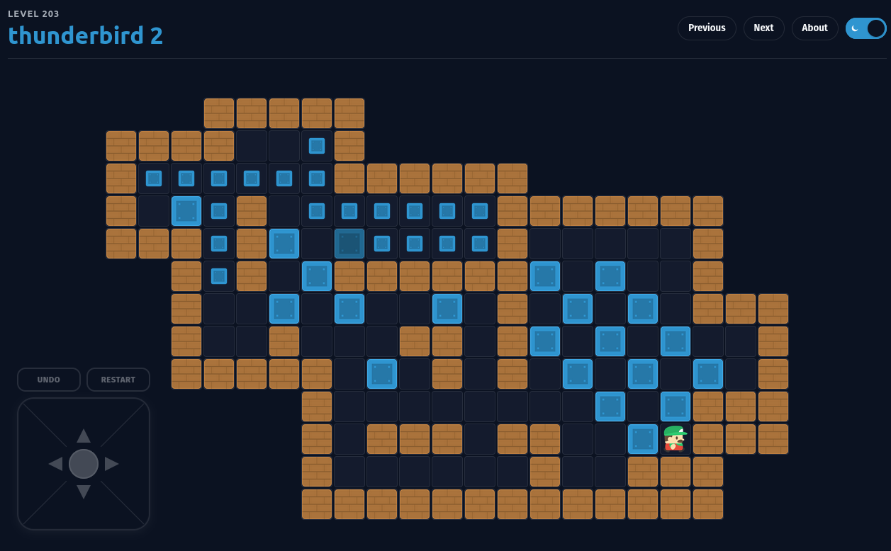

# Sokoban

Sokoban is a classic box-pushing puzzle game with 490 built-in levels.

Play in your browser: https://hubertbanas.github.io/sokoban/

### Which file should I download?

Click the [**Latest Release**](https://github.com/hubertbanas/sokoban/releases/latest), scroll to the `Assets` section, and download the file for your system:

| Operating System | Download This File |
| :--- | :--- |
| **Windows (Universal)** | `Sokoban-<version>-setup.exe` |
| **Linux (Universal)** | `Sokoban-<version>-x86_64.AppImage` |
| **Mac (Apple Silicon)** | `Sokoban-<version>-arm64.dmg` |
| **Mac (Intel)** | `Sokoban-<version>-x64.dmg` |
| **Android** | `Sokoban-<version>.apk` |

*(Note: Power users can find portable `.exe` files and native Linux packages like `.deb`, `.rpm`, and `.flatpak` in the full assets list).*

## Quick Controls

- `Arrow keys`: Move
- `Backspace`: Undo
- `Escape`: Restart current level
- `[` / `]`: Previous / Next level

## More Information

- More screenshots: [Screenshots](docs/screenshots.md)
- Technical and development docs: [Development & Technical Notes](docs/development.md)
- Developers should start with `./scripts/build-releases.sh` (details in the technical notes).

## Attribution

- Game graphics: [Kenney.nl Sokoban Asset Pack](https://kenney.nl/assets/sokoban) under the [CC0 1.0 Universal (Public Domain)](https://creativecommons.org/publicdomain/zero/1.0/) license
- Original project: https://github.com/ecyrbe/sokoban
- Current repository: https://github.com/hubertbanas/sokoban

## License

MIT. See `LICENSE`.

## Changelog

See `CHANGELOG.md` for project history and recent updates.
