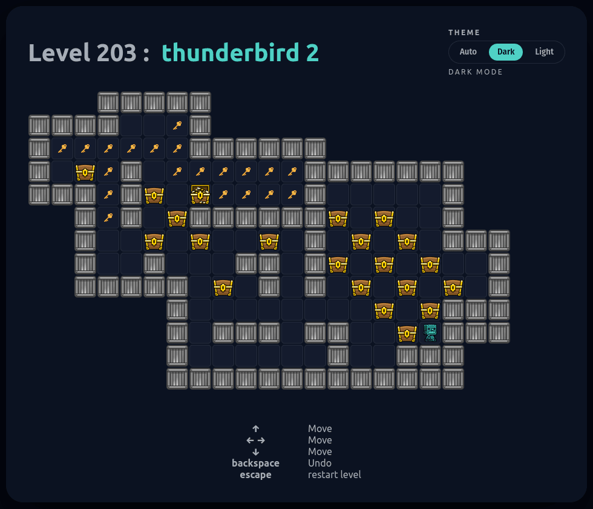

# Sokoban

A modernized Sokoban implementation built with React + TypeScript + Vite.

Live app: https://hubertbanas.github.io/sokoban/

## What Is Included

- 490 bundled puzzle levels (`Original`, `Atlas01` to `Atlas04`)
- Keyboard gameplay controls (move, undo, restart, level navigation)
- Mobile/coarse-pointer touch controls with a draggable dpad
- Hold-to-repeat behavior for level and direction controls
- Light/dark theme support with persisted user preference
- About modal with runtime app version from `package.json`
- Docker and Docker Compose support for dev/prod usage
- GitHub Actions for Pages deploy, auto-tagging, and container publishing

## Mobile Touch Controls

The mobile dpad appears automatically on coarse-pointer/hoverless devices.

- Four directional touch regions (up/left/right/down)
- Press-and-hold repeats movement
- Center `+` handle can be dragged to reposition the control
- Double-tap the center `+` to reset dpad position
- Dedicated `Undo` and `Restart` touch buttons (mapped to Backspace and Escape actions)
- Dpad position is persisted in `localStorage`
- Long-press context menu is suppressed for stable hold behavior (including Firefox emulation scenarios)

## Controls

- `ArrowUp` / `ArrowDown` / `ArrowLeft` / `ArrowRight`: Move
- `Backspace`: Undo
- `Escape`: Restart current level (asks for confirmation after progress exists)
- `[` and `]`: Previous / Next level
- `Enter`: Continue after completion

UI controls:

- `Previous` / `Next` buttons support press-and-hold repeat
- Touch action buttons provide `Undo` and `Restart level` on mobile/coarse-pointer devices
- `Restart level` prompts for confirmation after at least one move
- `About` opens controls/project info and app version
- Theme switch toggles between light and dark mode

## Game Behavior Notes

- The board tile size adapts to viewport dimensions and level size.
- Level index is persisted in `localStorage` (`SokobanLevel`).
- Theme mode is persisted in `localStorage` (`sokoban-theme-mode`).
- When mode is `auto`, theme follows `prefers-color-scheme` unless `VITE_DEFAULT_THEME` is set to `dark` or `light`.

## Tech Stack

- React 18
- TypeScript
- Vite 5
- Lodash (deep cloning board state)
- CSS Modules for component styling

## Quick Start (Node)

Install dependencies:

```bash
yarn install
```

Start development server:

```bash
yarn dev
```

Build production bundle:

```bash
yarn build
```

Preview production bundle:

```bash
yarn preview
```

Equivalent `npm` commands work as well (`npm install`, `npm run dev`, `npm run build`, `npm run preview`).

## Docker

Build and run fully inside Docker (without local Node install):

```bash
docker run --rm -v "$PWD":/app -w /app node:24-alpine yarn install
docker run --rm -v "$PWD":/app -w /app node:24-alpine sh -c "yarn build && ls -R dist"
```

Project `Dockerfile` is multi-stage:

- Stage 1: `node:24-alpine` builds `dist/`
- Stage 2: `nginx:alpine` serves static files on port `80`

## Docker Compose

### Development (`compose.dev.yaml`)

```bash
docker compose -f compose.dev.yaml build --progress=plain --no-cache
docker compose -f compose.dev.yaml up -d
```

- Service/container: `sokoban-dev`
- Host port: `8081` -> container `80`

### Production (`compose.prod.yaml`)

```bash
docker compose -f compose.prod.yaml up -d
```

- Pulls image: `ghcr.io/hubertbanas/sokoban:latest`
- Service/container: `sokoban-prod`
- Host port: `8080` -> container `80`

## CI/CD Workflows

- `pages.yml`: Builds and deploys `dist/` to GitHub Pages on push to `main`/`master`.
- `auto-tag.yml`: Creates `v<version>` tag when `package.json` version changes on `main`/`master`.
- `reusable-docker-publish.yml`: Builds and pushes GHCR image tags from release tags.
- `codeql-analysis.yml`: Static security analysis.

## Project Layout

- `src/Game.tsx`: Main game UI and keyboard bindings
- `src/hooks/sokoban.ts`: Core move logic and board history
- `src/hooks/levels.ts`: Level loading and parsing
- `src/components/mobile-controls.tsx`: Touch dpad behavior
- `src/components/sokoban.module.css`: Main game/control styling
- `src/hooks/theme.tsx`: Theme resolution and persistence

## Screenshots



Light theme preview: [docs/assets/screenshot-gameplay-light.png](docs/assets/screenshot-gameplay-light.png)

## Attribution

- Original project: https://github.com/ecyrbe/sokoban
- Current repository: https://github.com/hubertbanas/sokoban

## License

MIT. See `LICENSE`.